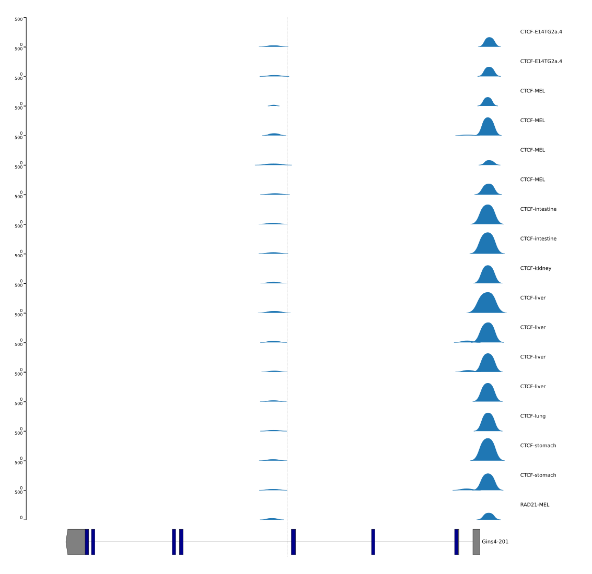

# Looking for regulatory elements around the mutation

- Comprehensive checking of the ENCODE datasets
    - ATAC-seq mouse (163 samples from dozens of tissues or cells)
    - ATAC-seq human (292 samples from dozens of tissues or cells)
    - ChIP-seq mouse (320 samples from dozens of tissues or cells for 53 TFs)
    - ChIP-seq human (2733 samples from dozens of tissues or cells for 714 TFs)

- Other datasets
    - ATAC-seq of mouse preimplantation embryos ([Nature Genetics 2016](wu2016.pdf))
    - ATAC-seq of Claire's HNF1A project (54 samples differentiated from human IPSc to BLC) 
    - scATAC-seq data of human fetus pancreas (UCSF), adult islets/pancreas

- Prediction by DeepSEA

------

- ATAC-seq mouse (83 samples from dozens of tissues or cells)

Only the 2 samples with peaks detected in the intron between exon4 and exon5 are plotted. The peaks are far from the mutation which is indicated by the dash line.

- ATAC-seq human (231 samples from dozens of tissues or cells)

The wasn't any peaks detected in the intron between exon4 and exon5 in any of the 231 samples.

- ChIP-seq mouse (177 samples from dozens of tissues or cells for 53 TFs)

Only the 17 samples with peaks detected in the intron between exon4 and exon5 are plotted. CTCF seems able to bind to the region a little bit downstream of the mutation, but the signal is very weak compared the promoter. Considering the binding sites of CTCF are so pervasive, at the moment I don't think it is very suspicious. However, this might be worth a follow up in islet cells if the test of splicing shows negative.

- ChIP-seq human (2679 samples from dozens of tissues or cells for 714 TFs)

The wasn't any peaks detected in the intron between exon4 and exon5 in any of the 2679 samples. Even for CTCF, we didn't see any signals here.

----

A bonus by checking the ChIP-seq data: The bellowing 15 TFs targeted to the promotor region of GINS4 in both human and mouse datasets. However, we should be aware that there are 714 TFs captured in human while only 53 TFs in mouse. Actually, there are peaks detected in 194 of the 714 TFs in the promoter region of GINS4 and 29 of the 53 TFs in mouse.

| |  |  |  |
| --- | --- | --- | --- |
| CTCF | POLR2A | RAD21 | CHD2 |
| SIN3A | SMC3 | MAX | MAZ |
| E2F4 | ELF1 | MXI1 | EP300 |
| USF1 | NRF1 | POLR2AphosphoS2 |

----

- ATAC-seq of mouse preimplantation embryos

Didn't see suspicious peaks.

- ATAC-seq of Claire's HNF1A project (54 samples differentiated from human IPSc to BLC) 

19 samples with peaks detected in the intron between exon4 and exon5 are plotted. Only one sample has a peak overlapped with the mutation, but I don't think it is suspicious.

- scATAC-seq data of human fetus pancreas (UCSF), adult islets/pancreas

No peaks detected in the intron between exon4 and exon5 at all.

- Prediction using [DeepSEA](http://deepsea.princeton.edu/job/analysis/create)

DeepSEA can accurately predict the epigenetic state of a sequence, including transcription factors binding, DNase I sensitivities and histone marks in multiple cell types, and further utilize this capability to predict the chromatin effects of sequence variants and prioritize regulatory variants.

Didn't see events/elements with high [normalized probability](http://deepsea.princeton.edu/job/analysis/results/a84f90bb-f383-442b-a500-b4642bf59c66)
