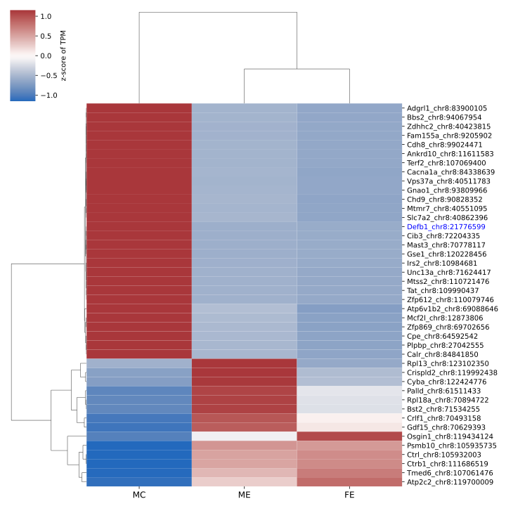
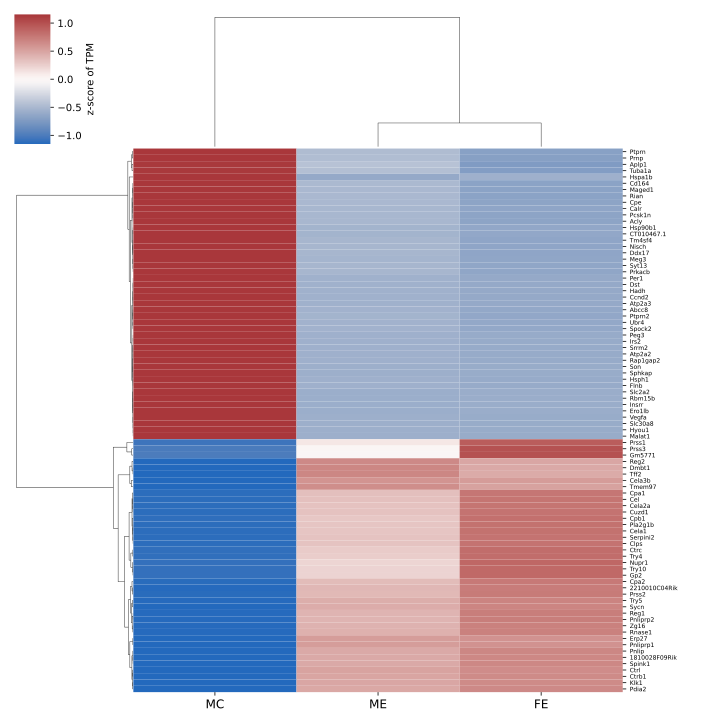
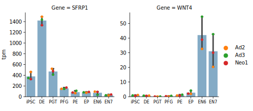
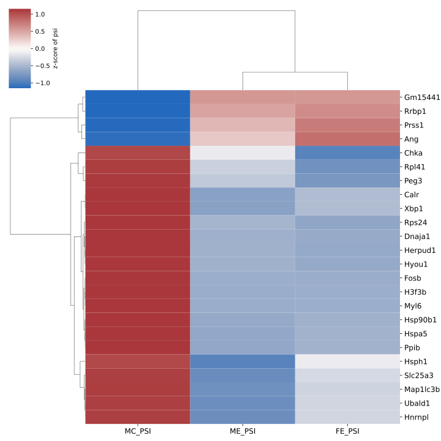

# Identifying causual variants of mice with diabetes

## RNA-Seq, three samples (ME:male, FE:female, and MC:control)

> MC:control must be male, inferred from the expression of genes on chrY.

> Area of interest, chr8:22974882-24576333 (GRCm38, mm10), from Ank1 to Ido2. More slides [here](NewDiabetesModel.pdf)

> Only the short "area of interest" that will be NOD genome, all the rest will be C57BL6/J. (From Grete)

### 1. Differential gene expression

- Significant genes:

    - DESeq2 (default median-like size factor), [597 genes](DiabetesMouse-Mut_vs_WT_AdjPval0.05.txt) with adjusted pvalue < 0.05, or [425 genes](DiabetesMouse-Mut_vs_WT_AdjPval0.05BaseMean100MinFC1.5.txt) with adjusted pvalue < 0.05, BaseMean > 100, and fold change > 1.5.

    - DESeq2 (total reads estimated size factor), [706 genes](DiabetesMouse-Mut_vs_WT_SizeFactorTotalReads_AdjPval0.05.txt) with adjusted pvalue < 0.05, or [459 genes](DiabetesMouse-Mut_vs_WT_SizeFactorTotalReads_AdjPval0.05BaseMean100MinFC1.5.txt) with adjusted pvalue < 0.05, BaseMean > 100, and fold change > 1.5.

> Usually the median-like size factor estimated by DESeq2 is consistent with the one estimated by total reads. However, the estimated size factors are different for these three samples.

> The size factor [ME, FE, MC] from DESeq2 is [1.46, 0.45, 1.51], while the size factor from total reads is [2.31, 1.00, 1.47]. The sizes of bam files are [2.3Gb, 1.2GB, 1.3Gb]

- Significant genes on chr8

> No significant genes in the area of interest. The closest one is Defb1, but it is still 1Mb away.

- GO enrichment, based on significant genes (adjusted pvalue < 0.05) from DESeq2 (total reads estimated size factor):

    - [GO process](DiabetesMouse-Mut_vs_WT_SizeFactorTotalReads_GOPROCESS.xls)

    - [GO function](DiabetesMouse-Mut_vs_WT_SizeFactorTotalReads_GOFUNCTION.xls)

    - [GO component](DiabetesMouse-Mut_vs_WT_SizeFactorTotalReads_GOCOMPONENT.xls)

    > enrichment of regulation of hormone levels, hormone secretion, insulin secretion, or nervous system process etc.

    - Clustermap of significant genes involoved in regulation of hormone levels
    
    
    
<!--

    - Clustermap of significant genes with adjusted pvalue < 0.05, BaseMean > 500, and fold change > 2.

    

-->

### 2. Call mutations from RNA-Seq

- Variants called using VarScan2 and annotated using VEP:

    - [722 variants](ME_FE.cns.vep.vcf) shared between ME and FE, but not in MC.

    > Didn't see variants in the area of interest

    - [5 variants](ME_aoi.cns.vep.vcf) in the area of interest in ME
    
    > All the 5 variants are in 3' UTR of **Sfrp1**, all have been in dbSNP, more likely due to lower expresion (less coverage) of this gene in FE and MC.
    
    > Soluble frizzled-related proteins (sFRPS) function as modulators of Wnt signaling through direct interaction with Wnts. They have a role in regulating cell growth and differentiation in specific cell types.

    > Wnt4 is down regulated in ME and FE.

    > SFRP1 and WNT4 expression on different stages in our ips differentiated human cell lines.

    

    
### 3. Differential splicing

[Significant splicing events identified by DEXSeq](DiabetesMouse_DEXSeq_MutVsWT_MultiLinesFixed_GeneName_ExonPos_IRER_deltaPSI_Padj0.05_BaseMean20_DeltaPSI0.1_TopExons.txt) (padj < 0.05, exonBaseMean > 20, deltaPSI > 0.1)

> No significant genes in the area of interest.

## WES

## WGS
