# Whole genome sequencing (WGS) data analysis

## Area of interest from Grete

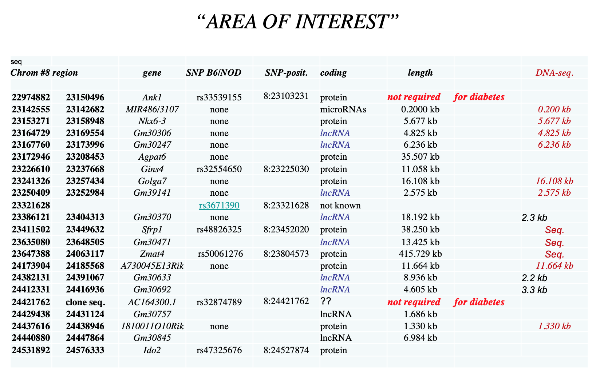

> Area of interest, chr8:22974882-24576333 (GRCm38, mm10), from Ank1 to Ido2. More slides [here](NewDiabetesModel.pdf)

## Main Hypothesis from Anna

The hypothesis is that there is a regulatory variant in this region which the diabetic B6/NOD mouse will be homozygous for. The B6 mouse will be wild type and the NOD mouse will be heterozygous. We hypothesize that the variant is present in a regulatory element which is both temporally and spatially active restricting the phenotype to the islet and allowing normal development of the pancreas, if not the islet.

## Alternative Hypothesis by Han

The alternative hypothesis is that there is a regulatory variant in this region which the diabetic B6/NOD mouse will be homozygous for. The B6 mouse will be wild type. **The NOD mouse will also be wild type**, in case the NOD mouse we are sequencing is not the original mouse which was crossed back. The logic is maybe there is a heterozygous mutation spontaneously occured in the NOD mouse, and during the cross back, the homozygous appeared in the B6/NOD mouse and lead to the phenotype. The mutation should be spontaneously occured rather than carried by all the NOD mouse, otherwise the phenotype proably have already been observed by others in their crossing back.

## WGS of three samples (average depth is 50X)

- DM: B6/NOD diabetic mouse
- NOD: control
- B6: control

> **Looking for variants: homozygous in DM, heterozygous in NOD, and wt in B6**

> **Or looking for variants: homozygous in DM, wt in NOD, and wt in B6**

## WGS data analysis

- Aligned fastq files to GRCm38 using bwa
- Call snvs/indels using [Strelka2](https://github.com/Illumina/strelka) and [VarScan2](http://dkoboldt.github.io/varscan/)
- Annotated variants using VEP
- Focusing on the area of interest (AOI), extended by 3Mb each side
- Manucal check candidate variants using IGV

> Check this [table](DiabeticMouse_Strelka_Variants_AOI.vep.vcf) for all the variants.

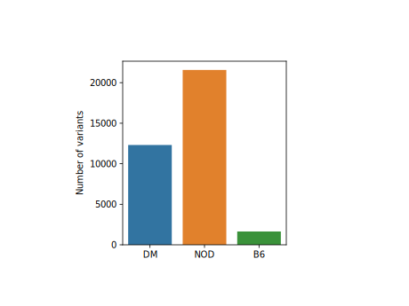

-----

## Two variants which are homozygous in DM, heterozygous in NOD, and wt in B6

- chr8:22958454, C -> T, rs51422859

- chr8:23267026, G -> A, rs51142241 

## One variant which is homozygous in DM, wt in NOD, and wt in B6

- chr8:23232493, G -> A

> Intronic variant (between exon4 and exon5) in Gins4. Top one candidate!

------

> Let's go through the top one variant first, and then the other two variants.

- chr8:23232493, G -> A

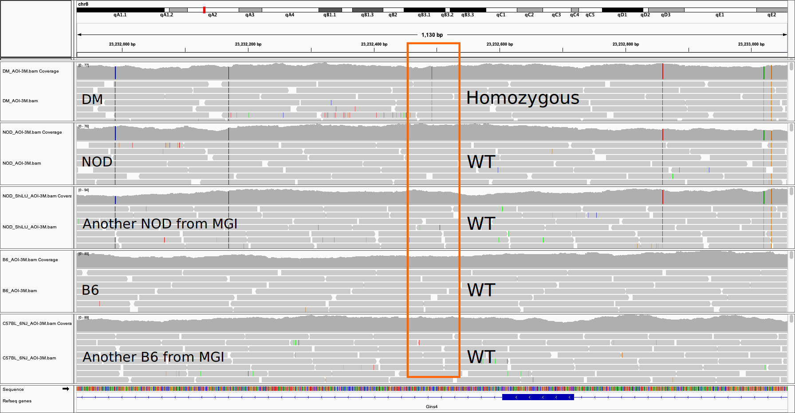

Zoom in to check this variant in DM. This region is very clean. Uniquely mapped reads. No doubt there is a homozygous mutation.

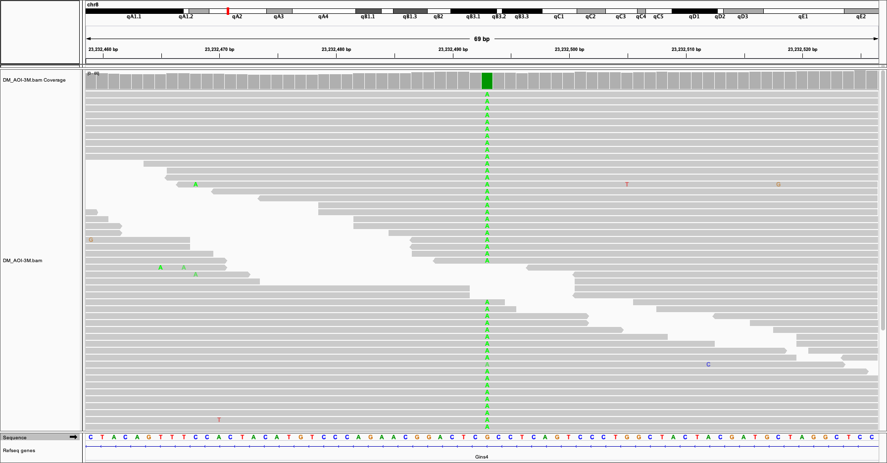

This variant didn't appear in all the 37 strains sequenced by [MGI](http://www.informatics.jax.org/).

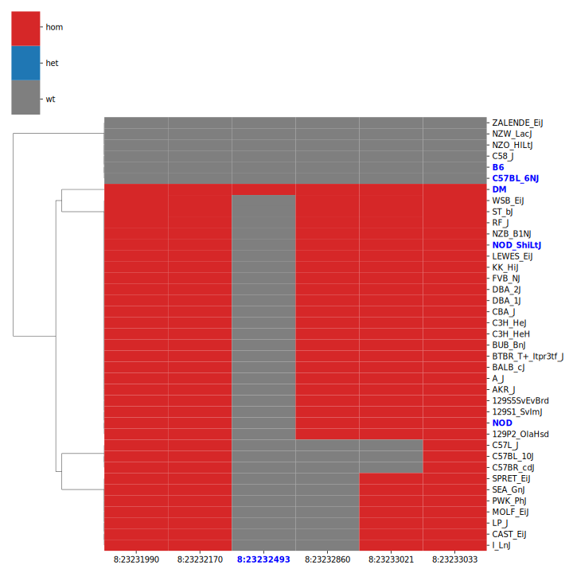

> **To do CRISPR! Is the homozygous mutation working in the context of other homozygous mutatioins as in the NOD genome? Or knocking in the homozygous mutation alone in the B6 mouse will be disease causing?**

The variant is not nessassary functioning on GINS4. However, GINS4 deserves the first consideration. 

> GINS4 seems only highly expressed in cultured cells from the GTEx dataset.

> GINS4 expression in the differentiation from iPSC to BLC in three cell lines. GINS4 is highly expressed in the early stage but then the expression becomes very low.

GINS4 is important for GINS complex assembly. The GINS complex plays an essential role in the initiation of DNA replication, and progression of DNA replication forks. (seems consistent with Grete's new transcription factor hypothesis)

Human GINS4 in [Type 2 Diabetes Knowledge Portal](https://t2d.hugeamp.org/)

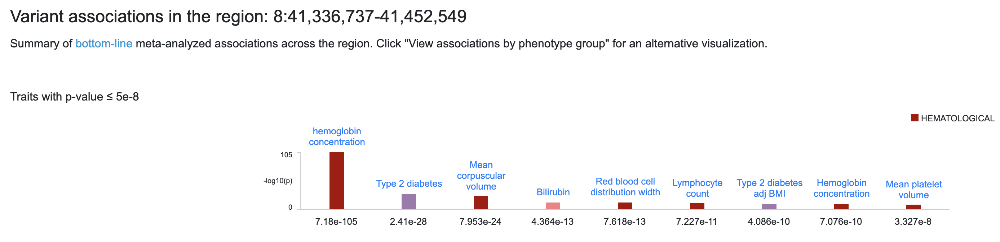

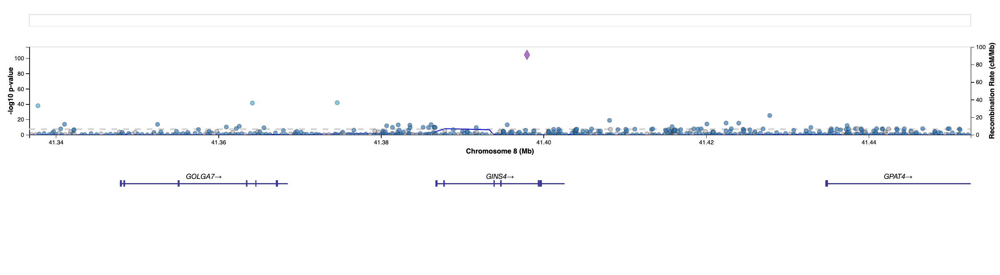

> It seems there is a loci (chr8:41397963, G -> C, GRCh37 | chr8:41540444, G -> C, GRCh38) in this region highly associated with hemoglobin concentration and may also with type 2 diabetes. chr8:23232493 (GRCm38, mm10) mapped to GRCh38 is chr8:41537444.

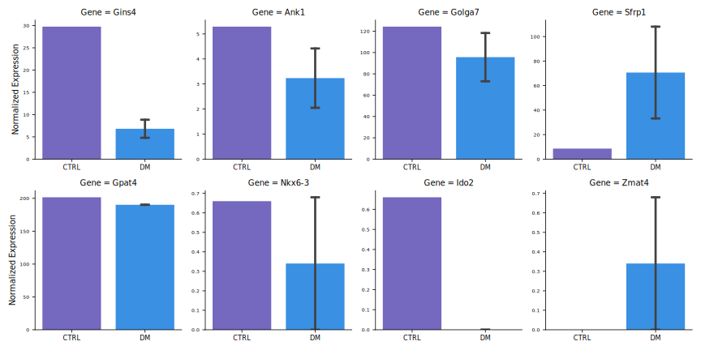

> In the RNA-Seq of three mouse, there is a trend of downregulation of Gins4. However, it is uncertain as the expression in all samples is very low.

> Maybe too speculative: one possiblity is this variant may create a cryptic splice site (GT ... AG) and lead to NMD/dysfunction of Gins4 whose normal function is indispensable in the early development.

> The mutated sequence does have higher potentiality to be a splice site.

------

> **The bellowing two variants could be safely excluded in my opinion.**

- chr8:22958454, C -> T, rs51422859

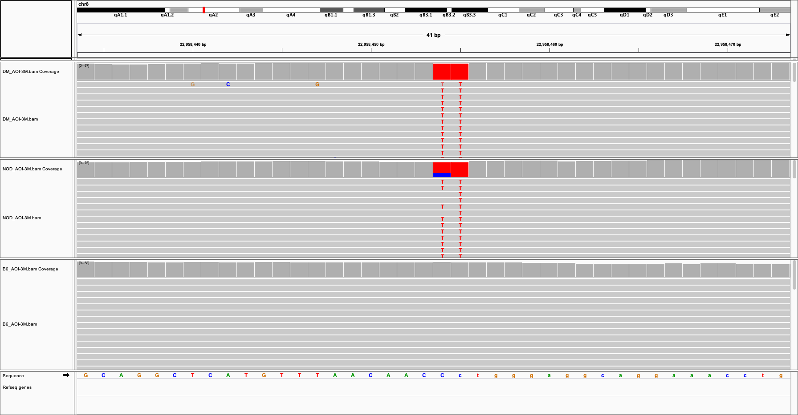

This variant is in the intergenic region between Kat6a and Ank1. 

It is 13bp upstream of a pseudogene, Gm10043 (chr8:22958207-22958441, reverse strand)

It seems the sequence around the variant is homolog of the exonic sequences of Lsm6

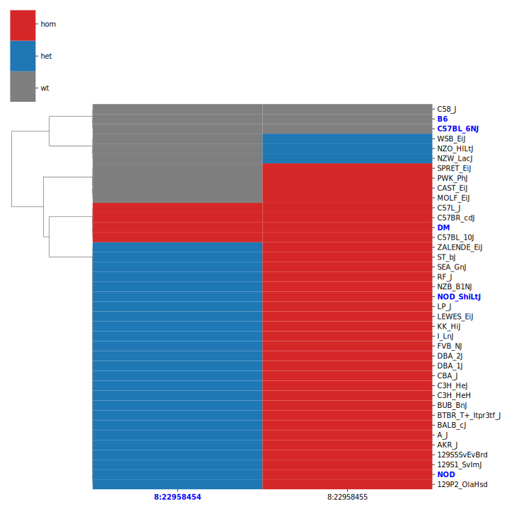

> Many strains are heterozygous, and a few strains also have homozygous.

-----

- chr8:23267026, G -> A, rs51142241

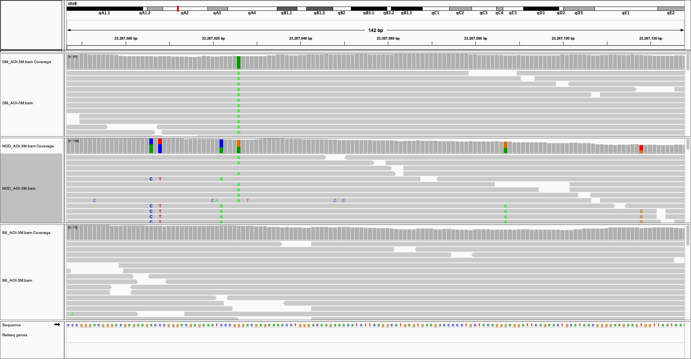

There are 5 extra variants around this variant in the NOD

From the reads we can tell, the variant is from one chromosome, while the extra 5 variants are linked together and from the other chromosome

It is hard to imagine chr8:23267026 homozygous mutation (25%) is deterious, while homozygous mutations on the extra 5 positions (also 25%) are normal.

This variant is in the intergenic region betweenn Golga7 (protein coding), Gm45412 (TEC, To be Experimentally Confirmed) and Gm24335 (snoRNA), Sfrp1 (protein coding).

Although we can be confident the aligned reads are uniquely mapped to this region. This region is highly repetitive across the genome.

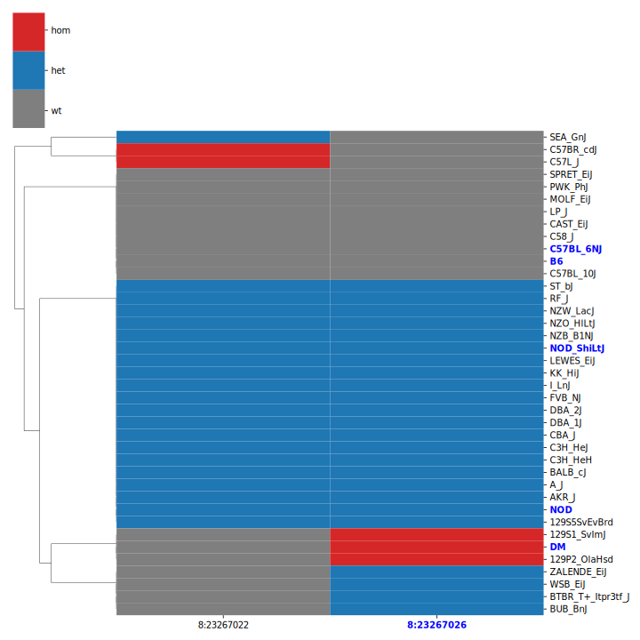

> Many strains are heterozygous. Two extra strains also are homozygous.

------

