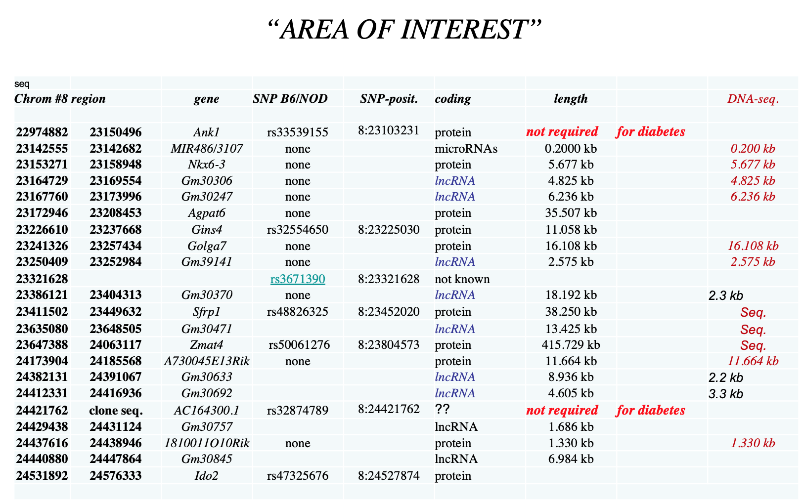
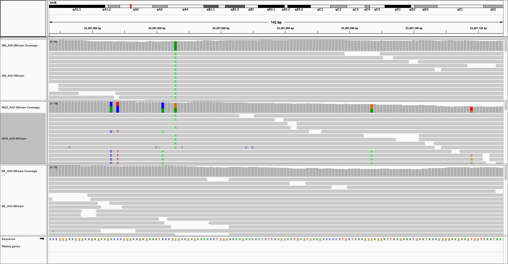
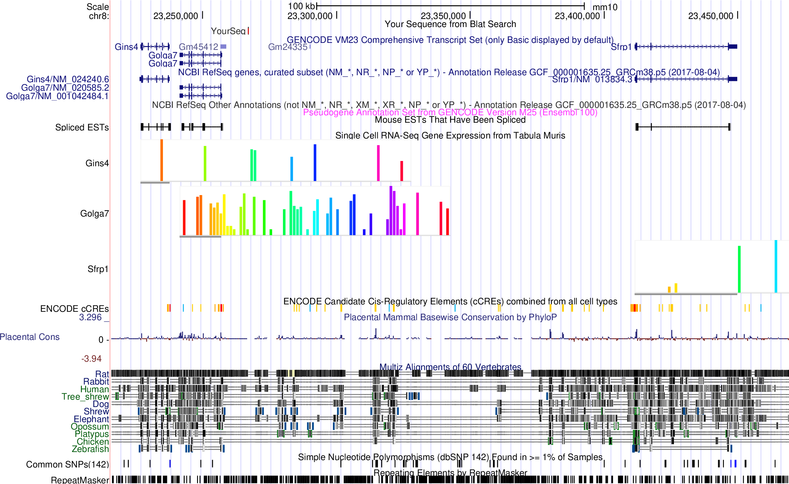
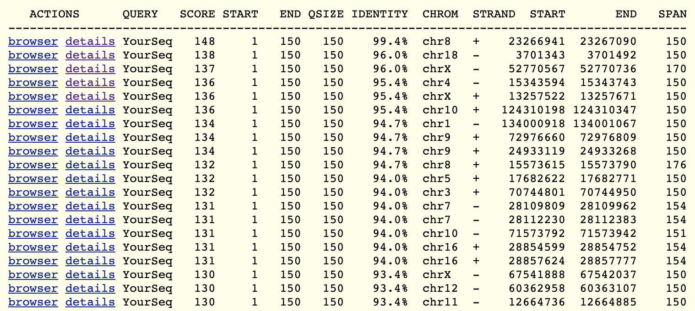
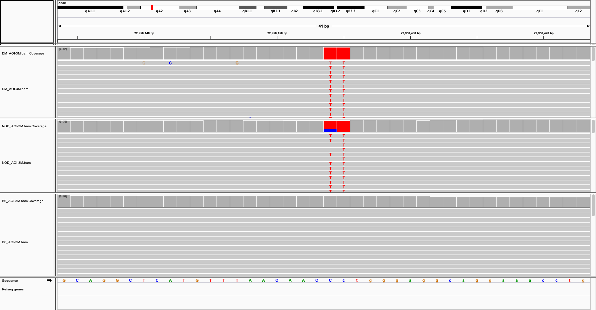
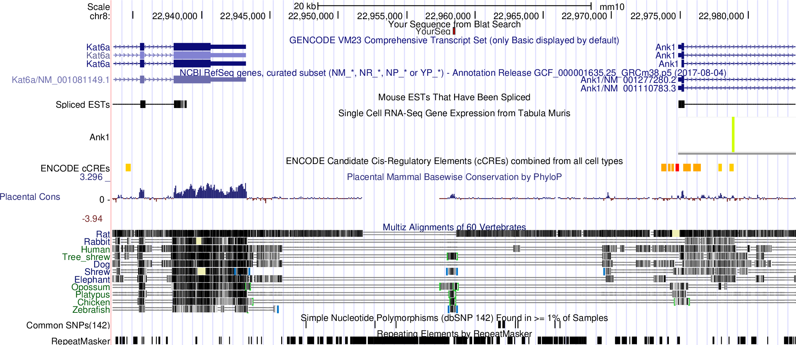
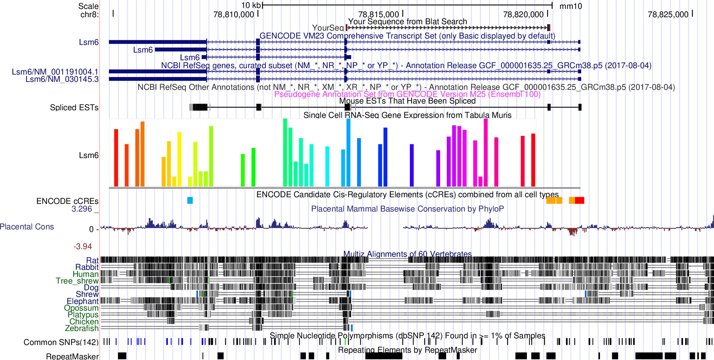

# Whole genome sequencing (WGS) data analysis

## Area of interest from Grete

> Area of interest, chr8:22974882-24576333 (GRCm38, mm10), from Ank1 to Ido2. More slides [here](NewDiabetesModel.pdf)

## Main Hypothesis from Anna

The hypothesis is that there is a regulatory variant in this region which the diabetic B6/NOD mouse will be homozygous for. The B6 mouse will be wild type and the NOD mouse will be heterozygous. We hypothesize that the variant is present in a regulatory element which is both temporally and spatially active restricting the phenotype to the islet and allowing normal development of the pancreas, if not the islet.

## Alternative Hypothesis by Han

The alternative hypothesis is that there is a regulatory variant in this region which the diabetic B6/NOD mouse will be homozygous for. The B6 mouse will be wild type. **The NOD mouse will also be wild type**, in case the NOD mouse we are sequencing is not the original mouse which was crossed back. The logic is maybe there is a heterozygous mutation spontaneously occured in the NOD mouse, and during the cross back, the homozygous appeared in the B6/NOD mouse and lead to the phenotype. The mutation should be spontaneously occured rather than carried by all the NOD mouse, otherwise the phenotype proably have already been observed by others in their crossing back.

## WGS of three samples (average depth is 50X)

- DM: B6/NOD diabetic mouse
- NOD: control
- B6: control

> **Looking for variants: homozygous in DM, heterozygous in NOD, and wt in B6**

> **Or looking for variants: homozygous in DM, wt in NOD, and wt in B6**

## WGS data analysis

- Aligned fastq files to GRCm38 using bwa
- Call snvs/indels using [Strelka2](https://github.com/Illumina/strelka) and [VarScan2](http://dkoboldt.github.io/varscan/)
- Annotated variants using VEP
- Focusing on the area of interest (AOI), extended by 3Mb each side
- Manucal check candidate variants using IGV

-----

## Two variants which are homozygous in DM, heterozygous in NOD, and wt in B6

1. chr8:23267026, G -> A, rs51142241 
2. chr8:22958454, C -> T, rs51422859

## One variant which is homozygous in DM, wt in NOD, and wt in B6

1. chr8:23232493, G -> A

> Intronic variant (between exon4 and exon5) in Gins4. Top one candidate!

------

1. chr8:23267026, G -> A, rs51142241

- There are 5 extra variants around this variant in the NOD

- From the reads we can tell, the variant is from one chromosome, while the extra 5 variants are linkend together and from the other chromosome

- It is hard to imagine chr8:23267026 homozygous mutation (25%) is deterious, while homozygous mutations on the extra 5 positions (also 25%) are normal.

- This variant is in the intergenic region betweenn Golga7 (protein coding), Gm45412 (TEC, To be Experimentally Confirmed) and Gm24335 (snoRNA), Sfrp1 (protein coding).

- Although we can be confident the aligned reads are uniquely mapped to this region. This region is highly repetitive across the genome.

------

2. chr8:22958454, C -> T, rs51422859

- This variant is in the intergenic region between Kat6a and Ank1

- It is 13bp upstream of a pseudogene, Gm10043 (chr8:22958207-22958441, reverse strand)

- It seems the sequence around the variant is homolog of the exonic sequences of Lsm6

-----

