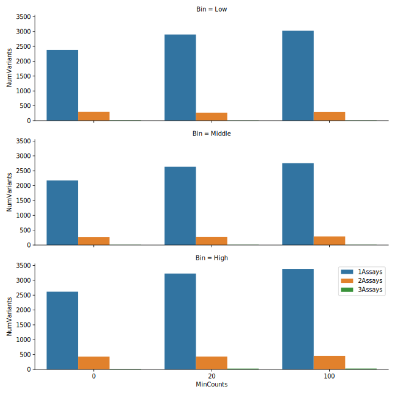

# Follow-up to Doug's Suggestions

- I’d want to dig into the fact that variants tend to appear in only one bin a bit more.  For example, do individual variants tend to end up on the same (single) bin over and over?  Or is it essentially random?  Or is it random for low count variants and less random for high-count variants (relative to the input library)? Knowing about that might help really diagnose whether it is a PCR problem.

> As shown in the venn diagrams for the variants appeared only in one assay/bin. They seem to be random (let me calculate p values this afternoon).

----

- Relative to Sanger sequencing, I was just saying you could transform the library into bacteria (such that each cell gets a single plasmid), plate the transformation, allow single cells to grow into colonies, pick 8-16 individual colonies, then sequence those (individual clones).  that would tell you if you had any big problems with the library you didn’t anticipate

> Thanks!

- Additionally, i’d still like to know what the correlation looks like for individual variant frequencies between the 3 unsorted bins, and all 3 sorted bins for the replicates

> After removing small counts (e.g. counts > 20), the correlations look good to me, however, the number of variants retained are also small (only ~10%). 

--------

OK, I think we are getting closer to an answer.  Here are a couple more thoughts/requests:

-Your Venn diagrams show which variants are present in only one bin, 2 or 3 across replicates.  That’s good to know.  It’d also be good to look at a plot of variant frequency vs. probability (variant in only one bin) for each replicate.  A second plot that would be helpful is a barplot showing the ## of single-bin variants that are in the same bin in all 3 replicates, in 2 or in none

> I am not quite sure what it is for variant frequency vs. probability (variant in only one bin) for each replicate.

-The correlations actually look OK, but I do think they reflect PCR problems.  The “wings” you see on the correlation plots are exactly what you get when PCR goes awry.  I bet they reflect variants that PCR’ed poorly (e.g. because of jackpotting) in one replicate but not another.  You could try to analyze just the variants with consistent frequencies in each bin across all 3 replicates and see if that set performs as expected.

> Thanks a lot. I agree with you. I will work on that. The issue is we don't have  positive controls any more after such filtering.
