# Follow-up to Doug's Suggestions

- I’d want to dig into the fact that variants tend to appear in only one bin a bit more.  For example, do individual variants tend to end up on the same (single) bin over and over?  Or is it essentially random?  Or is it random for low count variants and less random for high-count variants (relative to the input library)? Knowing about that might help really diagnose whether it is a PCR problem.

> As shown in the venn diagrams for the variants appeared only in one assay/bin. They seem to be random (let me calculate p values this afternoon).

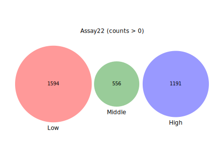
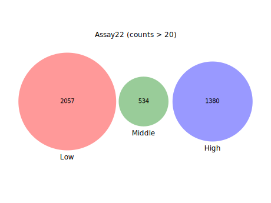
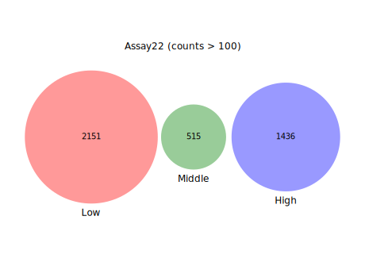

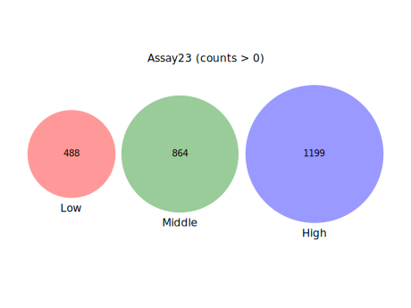
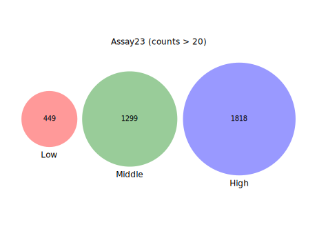
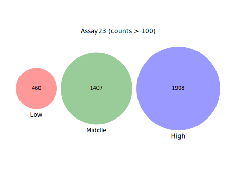

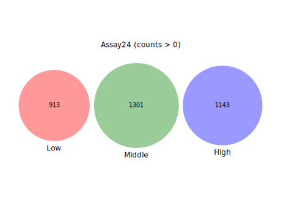
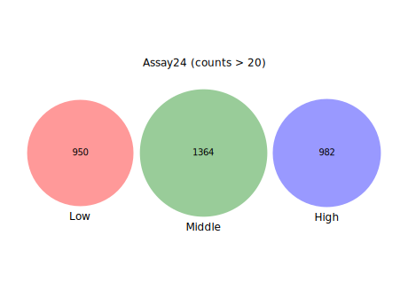
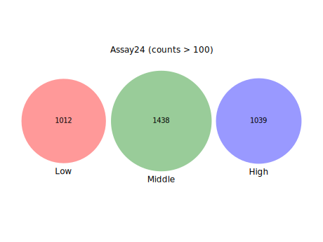

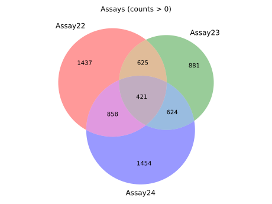
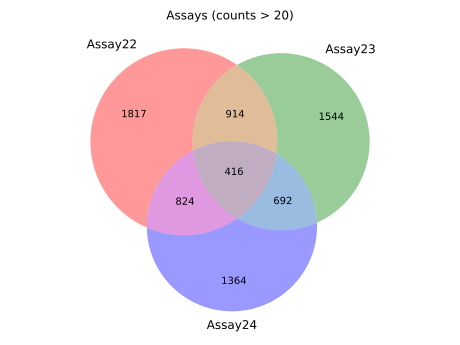
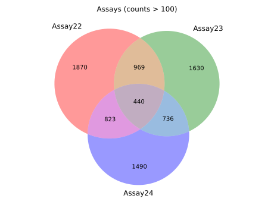

----

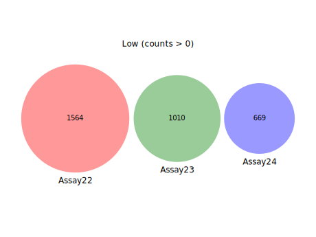
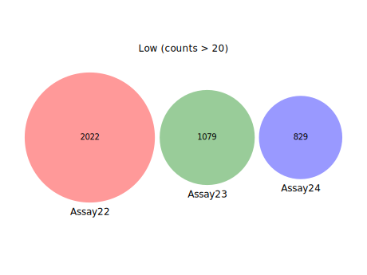
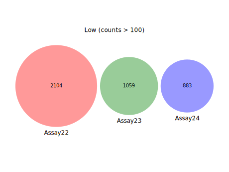

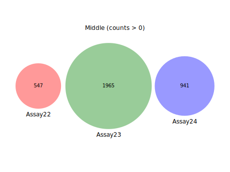
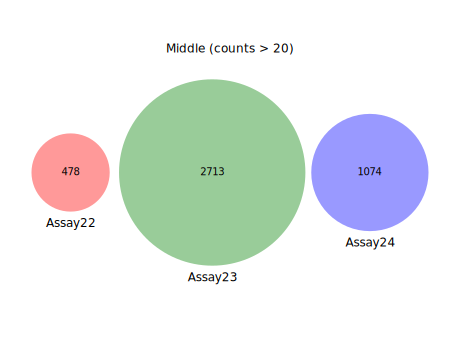
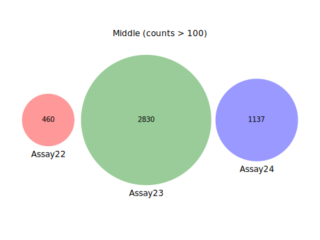

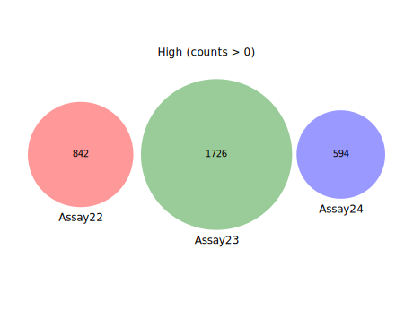
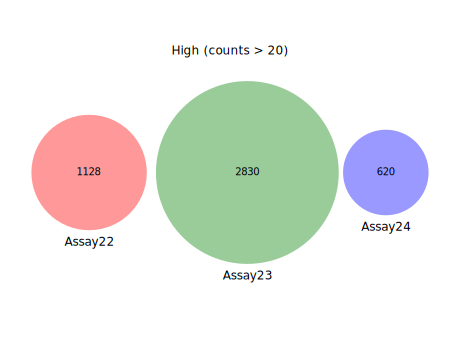
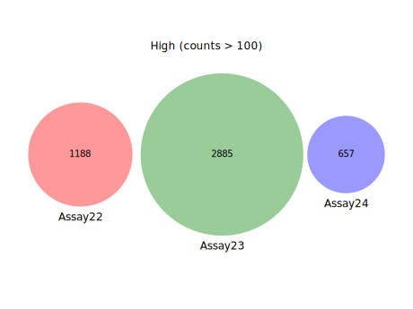

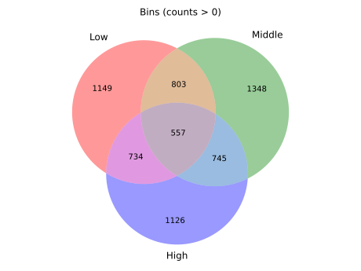
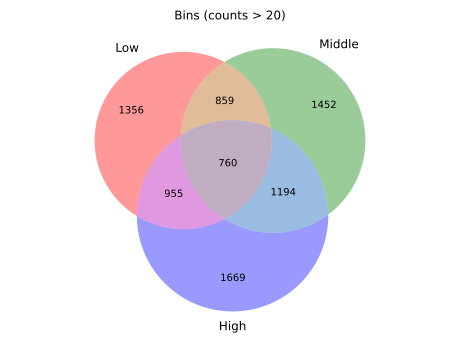

- Relative to Sanger sequencing, I was just saying you could transform the library into bacteria (such that each cell gets a single plasmid), plate the transformation, allow single cells to grow into colonies, pick 8-16 individual colonies, then sequence those (individual clones).  that would tell you if you had any big problems with the library you didn’t anticipate

> Thanks!

- Additionally, i’d still like to know what the correlation looks like for individual variant frequencies between the 3 unsorted bins, and all 3 sorted bins for the replicates

> After removing small counts (e.g. counts > 20), the correlations look good to me, however, the number of variants retained are also small (only ~10%). 

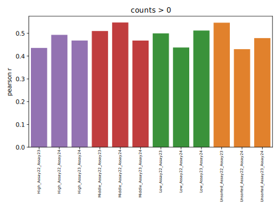
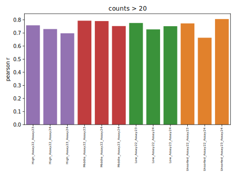

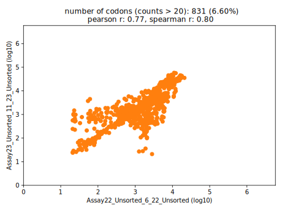
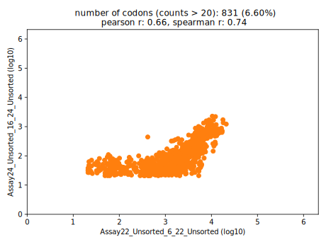
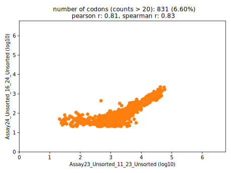

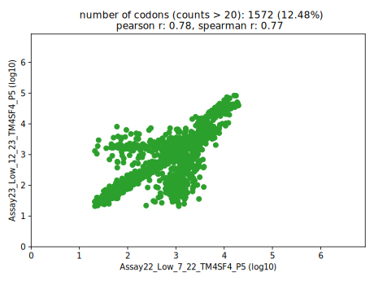
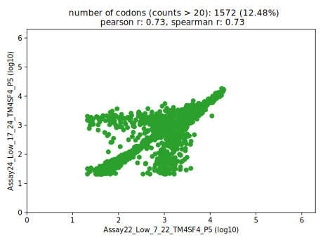
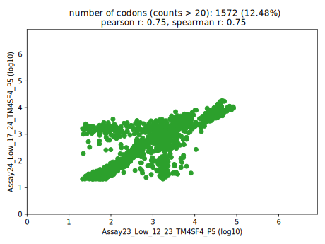

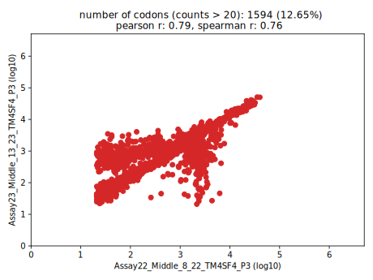
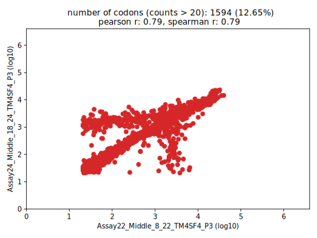
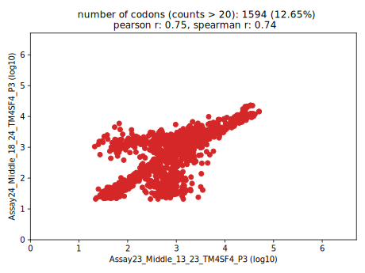

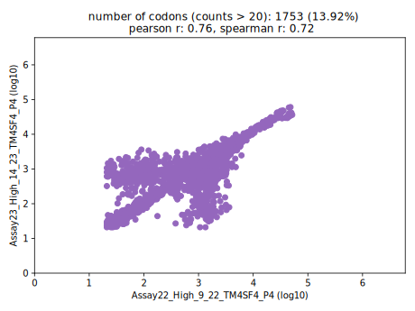
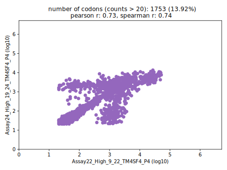
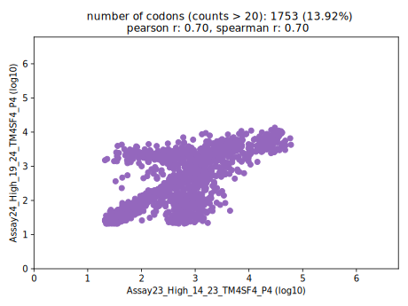

