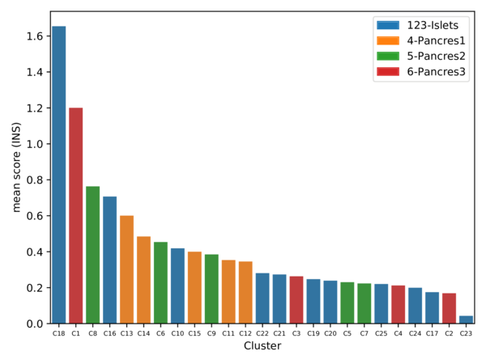
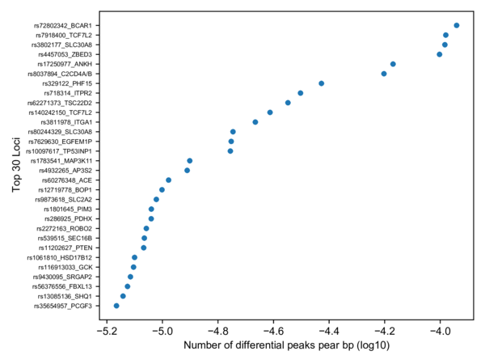

# scATAC-Seq analysis

## Meeting May 6, 2021

1. Compare fetus pancreas scATAC-Seq with adult islets and embryonic stem cells differentiated beta-like cells scATAC-Seq 

- [adult islet cells](https://www.nature.com/articles/s41588-021-00823-0#Abs1)
    - [pdf](Chiou2021.pdf)
    - [GEO](https://www.ncbi.nlm.nih.gov/geo/query/acc.cgi?acc=GSE160472)

- [pancreatic differentiation of human embryonic stem cells](https://www.ncbi.nlm.nih.gov/pmc/articles/PMC7864636/)
    - [pdf](Geusz2021.pdf)
    - [SRA](https://www.ncbi.nlm.nih.gov/bioproject/527099), [GEO](https://www.ncbi.nlm.nih.gov/geo/query/acc.cgi?acc=GSE115327)
    - bulk ATAC-Seq, not single cell/nucleus

- [differentiation from embryonic stem cells to beta-like cells](https://pubmed.ncbi.nlm.nih.gov/33257854/)
    - [pdf](Weng2021.pdf)
    - [GEO](https://www.ncbi.nlm.nih.gov/geo/query/acc.cgi?acc=GSE143783)
    - scRNA-Seq, not scATAC-Seq

> Pipeline used by Sean: [ArchR](https://www.archrproject.com/)

2. Align scATAC-Seq peaks with T2D credible sets in addition to the loci from GWAS catalog

----

For each png format plot in this document, there is a pdf version in the same folder.

----

1. samples (adult islet, adult pancreas, fetus pancreas)

| GSM | Sample | Info |
| --- | --- | --- |
| GSM4873768 | 1-Islet1 (combinatorial barcoding, CB) | Age32, Male, Non-Diabetic |
| GSM4873769 | 2-Islet2 (CB) | Age45, Male, Non-Diabetic |
| GSM4873770 | 3-Islet3 (CB) | Age62, Male, Non-Diabetic |
| GSM4873771 | 4-Pancreas1 (CB) | Age33, Male, Non-Diabetic |
| GSM4873772 | 5-Pancreas2 (10X) | Age33, Male, Non-Diabetic |
| UCSF | 6-Pancreas3 (10X) | Fetus, 12week, Epcam |

2. quality control

    - Fragment_Size_Distribution

<p float="left">


</p>

The fragment size distribution looks good, with a depletion of fragments that are the length of DNA wrapped around a nucleosome (approximately 147 bp).


    - TSS_by_Unique_Frags

<p float="left">


</p>

The TSS enrichment score (signal-to-background ratio) is okay. The Pancreas2 (10x) has many more cells, though the TSS score is also relatively low.

3. clustering


The clustering  makes sense. 

Three adult islets clustered together, and then with adult pancreas. All them are from combinatorial barcoding (CB) method.

Two clusters (Cluster4 and Cluster5) of adult pancreas suggested technical effects due to CB and 10x methods.

Fetus pancreas (Cluster6) is separated from adult pancreas (Cluster5) although they are both profiled using 10x. 


There is a large portion of alpha cells in the adult islets, however, there isn't much in the pancreas. 


There are beta cells presented in adult islets, fetus pancreas, and also adult pancreas, despite that only small proportion of cells in the last one.

----

We would like to explore the difference of beta cells in the fetus pancreas, adult pancreas, and adult islets. However, we should keep in mind there are a few caveats.

1. adult pancreas vs fetus pancreas: there is relatively a small proportion of beta cells in the adult pancreas and the sample size is one.

2. adult islets vs fetus pancreas: it is confounded by the profiling methods (CB vs 10x).

We are focusing on the comparison between adult pancreas and fetus pancreas in beta cells in the bellowing:

----

4. differential peaks


Adult pancreas vs fetus pancreas. The majority of differential peaks are down regulated, which suggested adult pancreas is less accessible compared to fetus.

Check this [table](BetaCells_DiffPeaks_AdultPancreas-vs-FetusPancreas_FDR0.05Log2FC1_6Samples.txt) for the significant peaks.

5. motif enrichment in differential peaks


Top hits in SMAD5, EGR1, WT1, ZBTB7A, etc in the contrast between adult pancreas and fetus pancreas. However, it might or might not make much sense that both up and down peaks share these motifs.

6. differential peaks aligned with T2D loci


T2D credible intervals ordered by the number of overlapped differential peaks (normalized by length of the interval)

rs231361_KCNQ1 has x-axis values as 0 because its position annotated in the table was a point rather than an interval.

The rs231361_KCNQ1 has been discussed in the Nature Genetics paper.

Separate up (more open in adults) and down (more open in fetus) peaks bellowing:


C8 is fetus pancreas, C1 is adult pancreas and C18 is adult islets.

Loops panel indicates T2D loci.

Check this [table](BetaCells_DiffPeaks_AdultPancreas-vs-FetusPancreas_FDR0.05Log2FC1_6Samples_T2D_Interval_ByLoci.txt) for the overlapped peaks.


-----

## Methods:

Adult pancreas and islets samples accessed from GEO (GSE160472, Chiou et al., Nature Genetics, 2021) database were analyzed together with our fetus pancreas samples. Combinatorial barcoding (CB) data were processed with the ENCODE ATAC-seq pipeline (v1.9.3) by aligning to the genome reference GRCh38. Cell barcoding information contained in the read names was added as CB tags in the bam files with a customized script. Only mapped reads with MAPQ score > 30 were retained. 10x data were processed using cellranger-atac (v2.0.0) against GRCh38 with default parameters. ArchR (v1.0.1) was used as a platform for the downstream analysis, including clustering, peak calling (MACS2, v2.2.7.1), differential peaks, and motif enrichment, based on the input files from either bam (CB data, with bcTag = "CB" for the createArrowFiles function) or fragments (10x data). Differential peaks were overlapped with the 99% credible sets for 380 distinct T2D association signals (Mahajan et al., Nature Genetics, 2018, Supplementary Table 5 with GRCh37 coordinates mapped to GRCh38 by LiftOver)

-----

## Extra analysis:

- Other types of cells (alpha and delta)?



For beta cells, the top three clusters are C18 (adult islets), C1 (adult pancreas), and C8 (fetus pancreas). Their relative heights make sense.


For alpha cels, top clusters are either adult islets or adult pancres (CB). We don't see many alpha cells in the fetus pancreas (the highest mean score is smaller than 0.5).


For delta cells, the top two clusters (C8 and C1) have already been asigned to beta cells (higher score in INS). Other clusters have poor scores.

- Adult islets vs fetus pancreas in beta cells

    - differential peaks


Adult islets vs fetus pancreas. The majority of differential peaks are down regulated, which suggested adult islets are less accessible compared to fetus. More more significant hits than adult pancreas vs fetus pancreas.

Check this [table](BetaCells_DiffPeaks_AdultIslet-vs-FetusPancreas_FDR0.05Log2FC1_6Samples.txt) for the significant peaks.

    - motif enrichment in differential peaks


Top hits in JUN and FOS families in the up regulated peaks while ZBTB7A, WT1, CTCFL, EGR1, etc in the down regulated peaks.

    - differential peaks aligned with T2D loci


T2D credible intervals ordered by the number of overlapped differential peaks (normalized by length of the interval)

Top three hits have x-axis values as 0 because their positions annotated in the table were points rather than intervals.

The rs231361_KCNQ1 has been discussed in the Nature Genetics paper.

Separate up (more open in adults) and down (more open in fetus) peaks bellowing:


C8 is fetus pancreas, C1 is adult pancreas and C18 is adult islets.

Loops panel indicates T2D loci.

Check this [table](BetaCells_DiffPeaks_AdultIslet-vs-FetusPancreas_FDR0.05Log2FC1_6Samples_T2D_Interval_ByLoci.txt) for the overlapped peaks.

------

Endocrine progenitor (NEUROG3) cells vs all fetal/adult Hormone+ (GCG, INS, SST, GHRL) cells?

- As discussed with Sean, try to annotate each dataset separately and then map those annotations on the merged dataset.


Annotating samples separately or together produced very similar results. So it doesn't matter about which method to use.

- Fetus Endocrine progenitor (NEUROG3) cells vs fetal/adult Hormone+ (GCG, INS, SST, GHRL) cells

Annotating cell types using the following rule:

```
Classify a cell to a cell type if one of the marker genes (GCG, INS, SST, GHRL, and NEUROG3) has the highest score. 

But the highest score should > 0.5, and the difference of the highest score and the second highest score should > 0.1.

Other cells are classified as Unknown.
```


    - differential peaks:


Check this [table](FetusEP-vs-FetusAdultHormone_FDR0.05Log2FC1_6Samples.txt) for the significant peaks.

    - motif enrichment in differential peaks (up and down)


    - differential peaks (up and down) aligned with T2D loci




- Borrowing annotation from the Nature Genetics Paper?

I think if we can these annotations (as well as the annotations we've made on the fetal dataset, plus the annotations from the 10x total pancreas samples) onto our merged object that contains both the fetal and adult samples then we will confidently know what cell types are what to do the comparisons between fetal and adult cells. What do you think?Actually looking at the GEO submission, it looks like they only include the cluster annotations for the islet samples and not the full pancreas ones.

> Yes, it is true they only included the three islet samples from CB method in their clustering as you can see from  their source code [here](https://github.com/kjgaulton/pipelines/blob/master/islet_snATAC_pipeline/islet_snATAC.ipynb). They collected the matrix and did the clustering themselves rather than using ArchR. I feel it is not very good or necessary to use their clustering labels.

