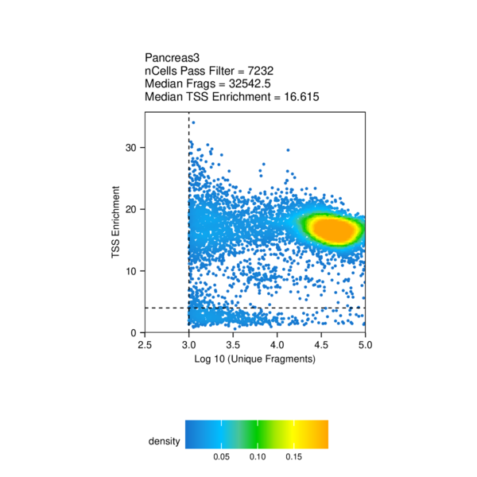

# scATAC-Seq analysis

## Meeting May 6, 2021

1. Compare fetus pancreas scATAC-Seq with adult islets and embryonic stem cells differentiated beta-like cells scATAC-Seq 

- [adult islet cells](https://www.nature.com/articles/s41588-021-00823-0#Abs1)
    - [pdf](Chiou2021.pdf)
    - [GEO](https://www.ncbi.nlm.nih.gov/geo/query/acc.cgi?acc=GSE160472)

- [pancreatic differentiation of human embryonic stem cells](https://www.ncbi.nlm.nih.gov/pmc/articles/PMC7864636/)
    - [pdf](Geusz2021.pdf)
    - [SRA](https://www.ncbi.nlm.nih.gov/bioproject/527099), [GEO](https://www.ncbi.nlm.nih.gov/geo/query/acc.cgi?acc=GSE115327)
    - bulk ATAC-Seq, not single cell/nucleus

- [differentiation from embryonic stem cells to beta-like cells](https://pubmed.ncbi.nlm.nih.gov/33257854/)
    - [pdf](Weng2021.pdf)
    - [GEO](https://www.ncbi.nlm.nih.gov/geo/query/acc.cgi?acc=GSE143783)
    - scRNA-Seq, not scATAC-Seq

> Pipeline used by Sean: [ArchR](https://www.archrproject.com/)

2. Align scATAC-Seq peaks with T2D credible sets in addition to the loci from GWAS catalog

----

For each png format plot in this document, there is a pdf version in the same folder.

----

1. samples (adult islet, adult pancreas, fetus pancreas)

| GSM | Sample | Info |
| --- | --- | --- |
| GSM4873768 | Islet1 (combinatorial barcoding, CB) | Age32, Male, Non-Diabetic |
| GSM4873769 | Islet2 (CB) | Age45, Male, Non-Diabetic |
| GSM4873770 | Islet3 (CB) | Age62, Male, Non-Diabetic |
| GSM4873771 | Pancreas1 (CB) | Age33, Male, Non-Diabetic |
| GSM4873772 | Pancreas2 (10X) | Age33, Male, Non-Diabetic |
| UCSF | Pancreas3 (10X) | NA |

2. quality control

    - Fragment_Size_Distribution

The fragment size distribution looks good, with a depletion of fragments that are the length of DNA wrapped around a nucleosome (approximately 147 bp).

    - TSS_by_Unique_Frags

The TSS enrichment score (signal-to-background ratio) is okay. The Pancreas2 (10x) has many more cells, though the TSS score is also relatively low.

3. clustering

The clustering  makes sense. 

Three adult islets clustered together, and then with adult pancreas. All them are from combinatorial barcoding (CB) method.

Two clusters (Cluster4 and Cluster5) of adult pancreas suggested technical effects due to CB and 10x methods.

Fetus pancreas (Cluster6) is separated from adult pancreas (Cluster5) although they are both profiled using 10x. 

There is a large portion of alpha cells in the adult islets, however, there isn't much in the pancreas. 

There are beta cells presented in adult islets, fetus pancreas, and also adult pancreas, despite that only small number of cells in the last one.

----

We would like to explore the difference of beta cells in the fetus pancreas, adult pancreas, and adult islets. However, we should keep in mind there are a few caveats.

1. adult pancreas vs fetus pancreas: there is only a small portion of beta cells in the adult pancreas and the sample size is one.

2. adult islets vs fetus pancreas: it is confounded by the profiling methods (CB vs 10x).

----

4. differential peaks

adult pancreas vs fetus pancreas. The majority of differential peaks are down regulated, which suggested adult pancreas is less accessible compared to fetus.

adult islets vs fetus pancreas. Same trend as above that adult islets are less accessible. Furthermore, more differential peaks here, might be contributed by the different profiling methods. 

5. motif enrichment in differential peaks

Top hits in SMAD5, EGR1, WT1, etc in the contrast between adult pancreas and fetus pancreas. However, it might not make much sense that both up and down peaks share these motifs.

