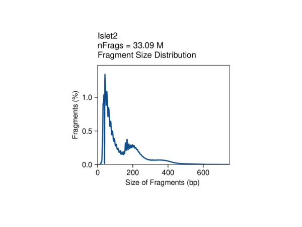
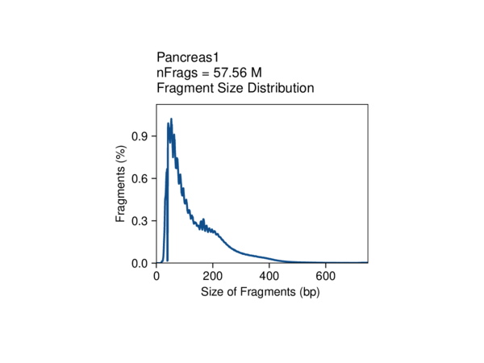
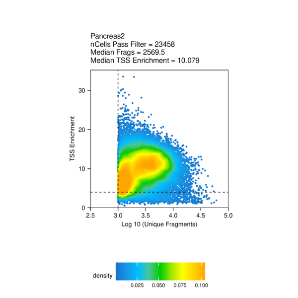
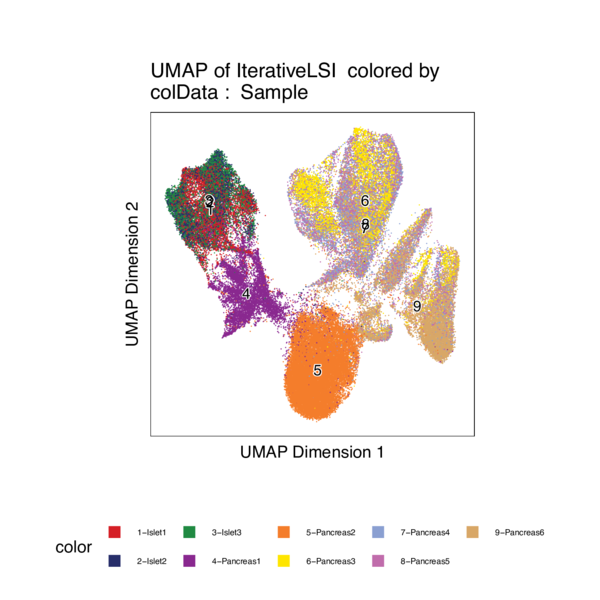

# scATAC-Seq analysis

## Meeting May 6, 2021

1. Compare fetus pancreas scATAC-Seq with adult islets and embryonic stem cells differentiated beta-like cells scATAC-Seq 

- [adult islet cells](https://www.nature.com/articles/s41588-021-00823-0#Abs1)
    - [pdf](Chiou2021.pdf)
    - [GEO](https://www.ncbi.nlm.nih.gov/geo/query/acc.cgi?acc=GSE160472)

- [pancreatic differentiation of human embryonic stem cells](https://www.ncbi.nlm.nih.gov/pmc/articles/PMC7864636/)
    - [pdf](Geusz2021.pdf)
    - [SRA](https://www.ncbi.nlm.nih.gov/bioproject/527099), [GEO](https://www.ncbi.nlm.nih.gov/geo/query/acc.cgi?acc=GSE115327)
    - bulk ATAC-Seq, not single cell/nucleus

- [differentiation from embryonic stem cells to beta-like cells](https://pubmed.ncbi.nlm.nih.gov/33257854/)
    - [pdf](Weng2021.pdf)
    - [GEO](https://www.ncbi.nlm.nih.gov/geo/query/acc.cgi?acc=GSE143783)
    - scRNA-Seq, not scATAC-Seq

> Pipeline used by Sean: [ArchR](https://www.archrproject.com/)

2. Align scATAC-Seq peaks with T2D credible sets in addition to the loci from GWAS catalog

----

For each png format plot in this document, there is a pdf version in the same folder.

----

1. samples (adult islet, adult pancreas, fetus pancreas)

| GSM | Sample | Info |
| --- | --- | --- |
| GSM4873768 | 1-Islet1 (combinatorial barcoding, CB) | Age32, Male, Non-Diabetic |
| GSM4873769 | 2-Islet2 (CB) | Age45, Male, Non-Diabetic |
| GSM4873770 | 3-Islet3 (CB) | Age62, Male, Non-Diabetic |
| GSM4873771 | 4-Pancreas1 (CB) | Age33, Male, Non-Diabetic |
| GSM4873772 | 5-Pancreas2 (10X) | Age33, Male, Non-Diabetic |
| UCSF | 6-Pancreas3 (10X) | Fetus, Epcam |
| UCSF | 7-Pancreas4 (10X) | Fetus, Epcam |
| UCSF | 8-Pancreas5 (10X) | Fetus, Epcam |
| UCSF | 9-Pancreas6 (10X) | Fetus, Whole |

2. quality control

    - Fragment_Size_Distribution

The fragment size distribution looks good, with a depletion of fragments that are the length of DNA wrapped around a nucleosome (approximately 147 bp).

    - TSS_by_Unique_Frags

The TSS enrichment score (signal-to-background ratio) is okay. Pancreas6 (10x) has more cells, probably because it is on whole pancreas. Pancreas2 (10x) has further more cells, though the TSS score is also relatively low.

3. clustering

The clustering  makes sense. 

Three adult islets clustered together, and then with adult pancreas. All them are from combinatorial barcoding (CB) method.

Two clusters (Cluster4 and Cluster5) of adult pancreas suggested technical effects due to CB and 10x methods.

Fetus pancreas (Cluster6, 7, 8, 9) is separated from adult pancreas (Cluster5) although they are both profiled using 10x. 

Epcam based fetus pancreas (Cluster6, 7, 8) is seprated from whole fetus pancreas (Cluster9).

There is a large proportion of alpha cells in the adult islets, however, there isn't much in the pancreas. 

There are beta cells presented in adult islets, fetus pancreas (Epcam), and also adult pancreas, despite that only small proportion of cells in the last one.

----

We would like to explore the difference of beta cells in the fetus pancreas, adult pancreas, and adult islets. However, we should keep in mind there are a few caveats.

1. adult pancreas vs fetus pancreas: there is only a small portion of beta cells in the adult pancreas and there is only one sample for adult pancreas.

2. adult islet vs fetus pancreas: it is confounded by the profiling methods (CB vs 10x).

We are going to compare (adult pancreas + adult islet) vs (fetus pancreas) in the bellowing.

----

4. differential peaks

The majority of differential peaks are down regulated, which suggested adult pancreas/islet is less accessible compared to fetus.

Check this [table](BetaCells_DiffPeaks_AdultIsletPancreas-vs-FetusPancreas_FDR0.05Log2FC1.txt) for the significant peaks.

5. motif enrichment in differential peaks

Top hits in JUN and FOSL family in the up peaks.
Top hits in CTCFL, EGR1, WT1, ZBTB7A, etc in the down regulated peaks between adult pancreas/islet and fetus pancreas.

6. differential peaks aligned with T2D loci

T2D credible intervals ordered by the number of overlapped differential peaks (normalized by length of the interval)

Top 4 hits have x-axis values as 0 because the positions annotated in the table  were points rather than intervals.

The rs231361_KCNQ1 has been discussed in the Nature Genetics paper.

C2 is adult islets, C7 is adult pancreas, C13 is fetus pancreas (Epcam)

Loops panel indicates T2D loci.

Check this [table](BetaCells_DiffPeaks_AdultIsletPancreas-vs-FetusPancreas_FDR0.05Log2FC1_T2D_Interval_ByLoci.txt) for the overlapped peaks.

-----

## Methods:

Adult pancreas and islets samples accessed from GEO (GSE160472, Chiou et al., Nature Genetics, 2021) database were analyzed together with our fetus pancreas samples. Combinatorial barcoding (CB) data were processed with the ENCODE ATAC-seq pipeline (v1.9.3) by aligning to the genome reference GRCh38. Cell barcoding information contained in the read names was added as CB tags in the bam files with a customized script. Only mapped reads with MAPQ score > 30 were retained. 10x data were processed using cellranger-atac (v2.0.0) against GRCh38 with default parameters. ArchR (v1.0.1) was used as a platform for the downstream analysis, including clustering, peak calling (MACS2, v2.2.7.1), differential peaks, and motif enrichment, based on the input files from either bam (CB data, with bcTag = "CB" for the createArrowFiles function) or fragments (10x data). Differential peaks were overlapped with the 99% credible sets for 380 distinct T2D association signals (Mahajan et al., Nature Genetics, 2018, Supplementary Table 5 with GRCh37 coordinates mapped to GRCh38 by LiftOver)

